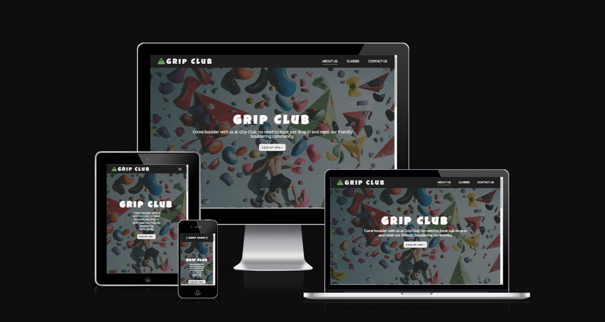
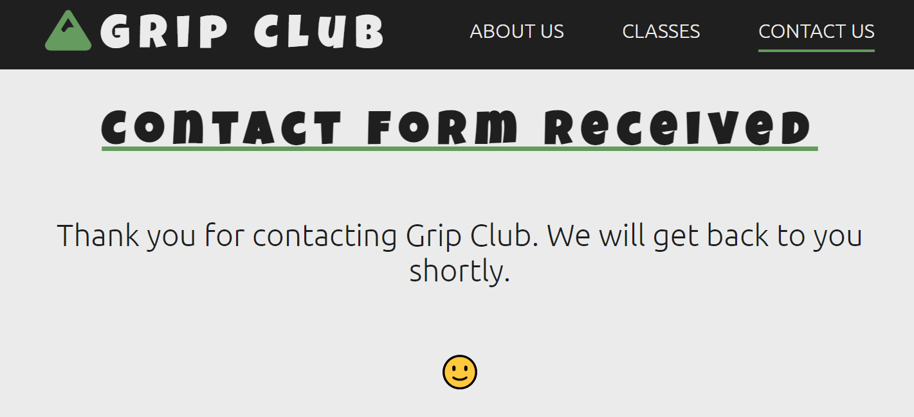
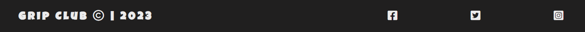
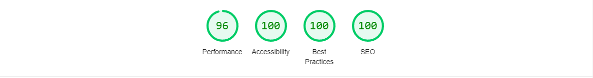
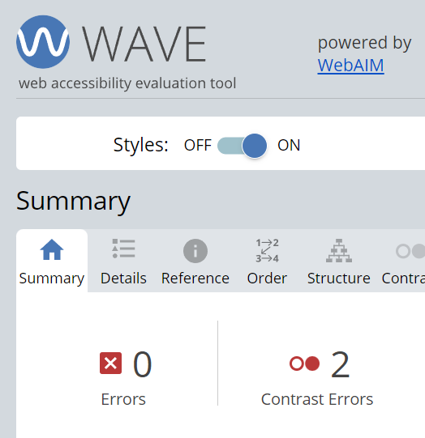
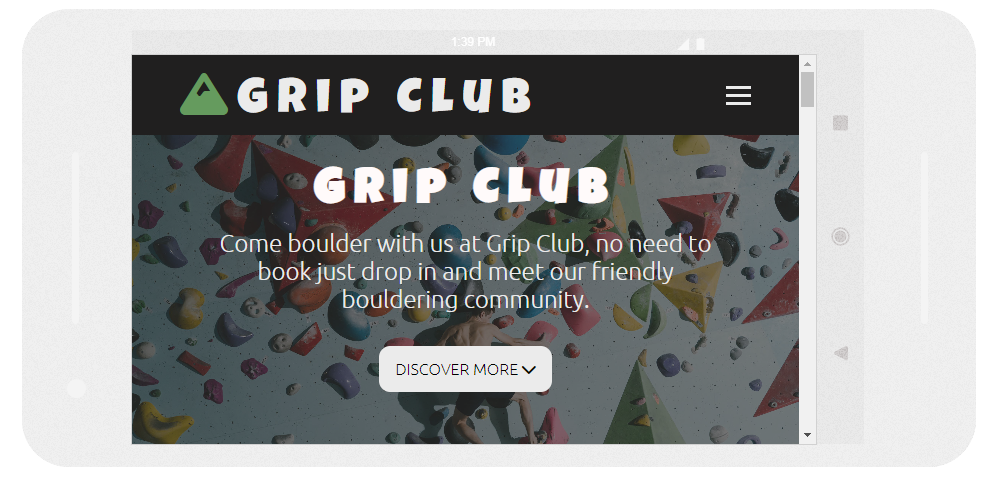
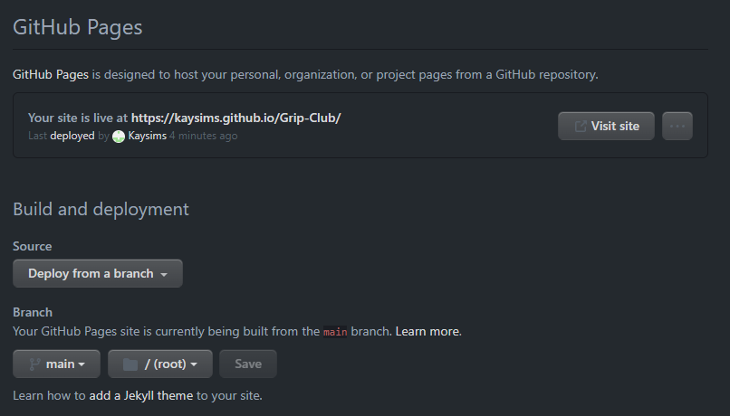

# Grip Club - Project Portfolio 1 - HTML & CSS 

Grip Club is a local family-run bouldering gym based in Essex. This site is aimed at people who want to get involved in bouldering, whether experienced or not. The site is also targeted towards individuals that would like to meet new people and socialise whilst bouldering. The site should provide users with guidance on what bouldering is, what the company aims to achieve, how they can get involved and how to contact Grip Club.

You can view the live site here - [Grip Club](https://kaysims.github.io/Grip-Club/)

# User Experience

## <u>Initial discussion :</u>
Grip Club is a bouldering gym in Essex. It aims to create a friendly and social environment where people can learn/improve their bouldering skills. 
The website is being used to drive more individuals to come down and try bouldering, providing users with more information about who Grip Club is and what they offer. In addition, the contact us section has been added so that people can ask questions and give feedback.

## <u>User stories :</u>
### Client Goals
* To create a responsive site.
* To create a site that can answer three questions from the opening page:
    1. Who is Grip Club 
    2. What Grip Club does
    3. How to get involved
* To create a site where people can contact Grip Club, ask questions, and give feedback.

### First-time visitor goals 
* I want to learn about Grip Club and understand what the club is about. 
* I want to navigate the site easily. 
* I want to see classes that can get me involved in bouldering. 

### Returning visitor goals
* I want to find out about any new events that are happening in the club. 
* I want to follow the social media pages for Grip Club.
* I want to contact the club quickly with questions and feedback.

## <u>Structure :</u>
I want to create a layout with a straightforward user journey that is easy to navigate and interact with. Starting with who Grip club is, what Grip Club is about, what Grip Club can offer and finally, a call to action. 

* The navigation menu will be fixed so the user can navigate between pages. In addition, the navigation menu for tablets and phones will be controlled via a hamburger so that it is responsive. This should allow users to easily navigate the site, which is a user goal.
  >  I want to be able to navigate the site easily.

* The home page will have a hero image that clearly shows what Grip Club is about. Plus, a title along with a short text about what Grip Club offers. Furthermore, a button to discover more about the company. This should answer the three essential questions about the company, which is a client goal. 
    >  1. Who Grip Club is
    >  2. What Grip Club does
    >  3. How to get involved

* The about us page will provide information about what bouldering is and what Grip Club can offer. It will include their mission, facilities and bouldering health benefits. This will give the user more information about the company, which is a user goal. 
  > I want to find out about Grip Club and understand what the club is about.

* The classes page will provide information on different classes that users can get involved in and join. This should achieve the user's goal of getting involved. 
  > I want to see classes that can get me involved in bouldering. 

 * The contact page will allow users to contact Grip club via a form. It will have a dropdown list to establish why the user is contacting and a text area so that they can type questions, feedback, and complaints. This is both a user and client requirement. 
   >    * To create a site where people can contact Grip Club, ask questions, and give feedback.
   >    * I want to contact the club quickly with questions and feedback.

  * The info section will include address, prices, and opening/closing times. This will provide important information for users so they can decide on visiting the club. This should achieve the user's goal of getting involved.
    > I want to be able to see classes that can get me involved in bouldering. 

* The footer will contain links to social media. This will enable users to follow Grip Club’s socials.
   > I want to be able to follow the social media pages for Grip Club.

 # Design

## <u>Colour scheme : </u>

The colour palette was created using [Coolors website,](https://coolors.co/) taking into account both colour psychology and accessibility. 

### Colour psychology 
* After looking into colour psychology, I decided to use green. This choice is because green is often associated with health and nature. Bouldering has many health benefits, and although this is an indoor gym due to its location, bouldering is often associated with the great outdoors. White and black were then chosen to create a clean and simple feel to the site.

    

### Colour accessibility 
*   To test the accessibility of the colours [Accessible color palette builder](https://toolness.github.io/accessible-color-matrix/?n=White&n=Black&n=Green&v=EBEBEB&v=201F1F&v=659B5E) was used. I used this to check that the colours meet the WCAG 2.1 AA and AAA guidelines. To further check these results [Adobe color](https://color.adobe.com/create/color-contrast-analyzer) was used, which gave the same results. The colours will be used per the below colour combinations recommended for the text and background colour.

    

## <u>Typography : </u>

[Google fonts](https://fonts.google.com/) was used to select the typography on this site. 

* Luckiest guy is used for headings on the site. It was chosen as it has a friendly, fun appearance which matches the environment Grip Club would like to create. Plus it is a San Serif typeface.
 

* Ubuntu light 300 was used for all other text on the page. It was chosen as it is a simple font. It is also a sans-serif font which is good for accessibility.

## <u>Imagery :</u>
All icons used are from [font-awesome.](https://fontawesome.com/) The images are all from [Pixels](https://www.pexels.com/).

## <u>Wireframes : </u>

[Balsamiq wireframes](https://balsamiq.com/) was used for all three pages creating templates for desktop, tablet and phone screens. Some changes have been made when making the site. 
 

<b>This is the template for the hero image and About Us page</b>

 

<b>This is the template for the Classes page</b>
 

 

<b>This is the template for the Contact Us page</b>
 

 

## <u>Features :</u>
The website is designed to be simple and easy to use. This is achieved by using common website features, like a nav bar, an icon, and a contact page. The site has three pages which are all accessible via the navigation bar. 
* ### Navigation bar:
    * The navigation bar remains fixed and contains links to different parts of the site.
    * The navigation bar is responsive as the hamburger icon allows the menu nav bar to compress on smaller screen sizes, it then has a dropdown function to select the page the user wishes to visit. 
    * The navigation bar has the Grip Club icon on the left.

    

<b>Desktop Navigation Bar Image</b>

    
    
 

    

<b>Mobile Navigation Bar Image</b>

    
    
 

    

<b>Mobile Navigation Bar Dropdown Image</b>

    
    
 

* ### Home page:
    * The home page is designed to clearly communicate who Grip Club is and what they offer. The hero image takes up the entire width of the screen. The page is responsive.
    * In the centre of the image is the Company name and a brief description of the club.
    * A button then allows users to jump to the About Us section which will provide further information about bouldering and the club. 

     

<b>Home Page Image</b>

    
    
 

* ### About us page:
    * The about us page is designed to provide information on what bouldering is, and more information about the club. The page is responsive.
    * There is a facilities section which lists the various facilities that the club offers. If using a smaller screen the facilities will stack on top of each other.
    * The benefits section tells the user how bouldering could benefit them, plus it has icons to catch the user's attention. Again, if using a smaller screen the benefits will stack on top of each other.

    

<b>About Us Image</b>

    
    
    

* ### Classes page: 
    * The classes page lists the different classes at Grip Club, this should encourage users to get involved. If using a smaller screen the classes will stack on top of each other.
    * Images are used to help get the user's attention. 
    * A brief text is provided about what the class is. 
    * There is a hover effect on the different classes.

    

<b>Classes Image</b>

    
    
  

* ### Contact us page:
    * The contact page asks for the user's name and email. This can only be submitted if the user fills this in. 
    * The contact page also has a dropdown for the user to select why they are contacting the club and a text area for them to write a message. 
    * A submit button allows users to submit the form, only if all sections are filled in. 
    * There is an info section which provides essential information about the club's location, prices and times that they are open and closed. 
    * Icons are used to grab the user's attention. 
    * If using a smaller screen the info section will stack on top of each other.

     

<b>Contact Us Image</b>

    
    
  

* ### Thank you page:
    * When a contact form is successfully submitted a thank you page is shown. The page thanks the user for contacting Grip Club and informs the user that someone will get back to them. 
    * The navigation menu is at the top for the user to continue looking at the site if they wish. 

    

<b>Thank You Page Image</b>

    
    
  
    
* ### Footer: 
    * The footer contains links to Grip Club's social media. They will open in a separate tab. Icons helped keep the footer simple. 
    * The footer icons enlarge when hovered over.
    * The footer is responsive when the screen size gets smaller the icons go below the logo and copyright text.

    

<b>Footer Desktop Image</b>

    
    
  

    

<b>Footer Hover Image</b>

    
    
  

    

<b>Footer Mobile Image</b>

    
    
  

* ### 404 Error page: 
    * The 404 page is displayed if the user navigates to a broken link.
    * The 404 page infroms the user that there is an error and to us the navigation menu to try again. 

    

<b>404 Page Image</b>

    
    
  

## <u>Future features : </u>
* ### Accessibility :
    * Using :focus states when creating accessible websites. I want to implement this once I have more understanding of how is best to use it. 
    * Implement a error message on forms, such as a red error message for incorrectly submitted form and a green error message for a submitted form. 

* ### Icon :
    * A more sophisticated logo within the Nav bar, so customers can easily link the logo with bouldering and Grip Club. I used a free icon, which does not convey the club well.
* ### Events calendar :
    * A simple calendar that allows users to see any events that are coming up. This would be an attractive addition to the website for frequent users. 

## <u>Accessibility : </u>
From the start, I have tried to ensure that accessibility is being prioritised and not compromised by the design so that the website works for everyone. To achieve this the below has been included : 
* Semantic HTML.
* Descriptive alt attributes on images. 
* Make sure that the colour contrast is accessible.

# Technologies used

### Languages :
* HTML - Used to give the content and structure to the site.
* CSS - Used to style the site.
* JavaScript - Used to create the responsive hamburger icon for mobile and tablet sites.

### Programmes used :
* [Balsamiq](https://balsamiq.com/) - Used to create wireframes.
* [Gitpod](https://www.gitpod.io/) - Used to create and edit the website.
* [GitHub](https://github.com/) - Used to save, store and deploy the site.
* [Google Fonts](https://fonts.google.com/) - Provided all fonts.
* [Font Awesome](https://fontawesome.com/)  - Provided all icons.
* [Google Dev Tools](https://www.google.com/chrome/dev/) - Used for help styling, responsiveness, and for testing.
* [Imageresizer](https://imageresizer.com/) - Used to re-size images. 
* [Tiny Ping](https://tinypng.com/) - Used to compress images for the readme.
* [A11y chicklist](https://www.a11yproject.com/checklist/) - Used to check the accessibility of the site with a checklist.
* [Coolors](https://coolors.co/) - Used to create a colour palette.
* [Accessible color combinations](https://toolness.github.io/accessible-color-matrix/?n=White&n=Black&n=Green&v=EBEBEB&v=201F1F&v=659B5E) - Used to check the colour contrast. 

# Testing
## Testing Code Validation
* Grip Club code was tested using W3C HTML and CSS validator, and the JS hint validator for the javascript. Below is the results after bugs have been corrected. This will be discussed in the bug fixed section. 

### HTML [W3C Html validator](https://validator.w3.org/) was used to test the HTML.
 * HTML W3C Validation no errors were found.
 

### CSS [W3C CSS validator](https://jigsaw.w3.org/css-validator/) was used to test the CSS.
 * CSS W3C Validation no errors were found.
 
    
### JS [Javascript hint validator](https://jshint.com/) was used to test the Javascript.
* Js Validation no errors were found.
 

 ## Lighthouse Testing
 * Lighthouse testing was used to check the performance, accessibility, best practice and SEO of the Grip Club website. The website went through [Google Dev Tools.](https://www.google.com/chrome/dev/)

* ### Chrome desktop About Us page Lighthouse results :

* ### Chrome desktop Classes page Lighthouse results :

* ### Chrome desktop Contact Us page Lighthouse results :

* ### Chrome desktop Thank You page Lighthouse results :

* Some bugs have been fixed before this lighthouse test was run, this will be discussed below in the fixed bugs section. The unfixed bugs will also be discussed in the bugs section below.
* The performance was down one point across all pages, the reason shown in dev tools was "Eliminate render-blocking resources".  
* The best practice for the Grip Club classes page was down eight points. This was due to incorrect aspect ratios for the images.

* ### Chrome mobile About Us page Lighthouse results :

* ### Chrome mobile Classes page Lighthouse results :

* ### Chrome mobile Contact Us page Lighthouse results :

* ### Chrome mobile Thank You page Lighthouse results :

* Some bugs have been fixed before this lighthouse test was run, this will be discussed below in the fixed bugs section. The unfixed bugs will also be discussed in the bugs section below.
* The mobile display's performance was down between 7-2 points. Again the "Eliminate render-blocking resources" was an error. Dev tools also glagged "enable text compression."
* The best practice for the Grip Club classes page was down eight points. This was due to incorrect aspect ratios for the images.

* ### Lighthouse conclusion : 
    The images used within the Grip Club website have caused points to drop across both desktop and mobile sites with the lighthouse tests. As this website is for educational purposes, I am going to keep the images the same. However in the future, with more experience or if this site were to go live, I would address these.

## Wave tool testing
[Wave tool](https://wave.webaim.org/) was used to test the Grip Club site further. Wave checked for any code errors and that the colour contrast used in the site was accessible. No errors were found.
* ### Wave tool results for the About Us page : 
  * The results show two contrast errors with the h1 and p in the hero section. I am not concerned with this as the contrast has passed other contrast tests and has met the WCAG 2.1 AA and AAA guidelines.

* ### Wave tool results for the Classes page :

* ### Wave tool results for the Contact Us page :

* ### Wave tool results for the Thank You page :

## Manual Testing
* On top of the other tests, I manually checked the site to ensure everything worked as expected.
  *  ### Navigation bar:
        * Tested that the links to the other pages worked correctly and would take the user to the correct page. 
        * Tested that the fixed nav worked and that the nav stayed at the top of the screen. 
        * Tested the hamburger and that it appeared when expected. Plus that the dropdown menu also worked as expected. 
        * Tested the icon text's size to ensure it continued to fit the nav bar even when the screen size was small. 

  * ### Home page:
    * Tested the hero image to ensure it expanded and shrunk with different screen sizes. 
    * Tested the header and paragraph to ensure it stayed centre and readable with different screen sizes. 
    * Tested the discover more button to check that it would take the user to the start of the About Us section. 

  * ### About Us page:
    * Tested the text and font to make sure it was responsive.
    * Tested the facilities and benefits section to make sure both responded the same way when the screen size got smaller. For example that they both went into a column at the same point. 
    * Checked the spelling for the About Us page. 

  * ### Classes page:
    *  Tested the text and font to make sure it was responsive and continued to fit in the card. 
    *  Tested that the images remained in the cards on different screen sizes. 
    *  Checked the spelling for the Classes page.
    *  Tested that the link in the Hire Us card would take users to the correct page. 

  * ### Contact Us page:
    * Tested that the information section was responsive.
    * Tested that the contact form only allowed users to submit after completing each box. 
    * Tested that when a form is submitted, a Popup appears as expected. 
    * Checked the spelling for the Classes page.

  * ### Thank You page:
    * Tested that the page appeared as expected. 
    * Tested each dropdown to ensure that the thank you page apperead when a form was submitted. 
    * Tested that the thank you page is responsive.

  * ### Footer:
    * Tested that the social media icons opened in a new top and that the links are correct.
    * Tested that the footer is responsive.

  * ### 404 page:
    * Tested that the 404 page would appear when an incorrect/broken link was used on the site. 
    * Tested that the 404 page is responsive.

## Accessibility testing 
* To check the accessibility of the Grip Club website, I used [a11y.](https://color.a11y.com/Contrast/) This checked the contrast and no issues were found. 

* ### A11y checker for About Us page :

* ### A11y checker for Classes page :

* ### A11y checker for Contact us page :

* I also used the [A11y project checklist](https://www.a11yproject.com/checklist/). 
    * It was used at the beginning of creating the site to familiarise me with accessibility. I then completed it once the site was finished. There were some things that could not be ticked off, such as ensuring controls have :focus states.
    * I have also jumped some headings, the reason I did this was to help with the sizing of text, but now I understand that this should not have been done. 
    * I should have included error messages for forms, I did add a thank you popup, but this is not enough to achieve accessibility.  
    * I hope to learn a lot more about accessibility as I progress through the code institute course.

## Responsiveness Testing
* To check the responsive design of the Grip Club Website, [Google Dev Tools](https://www.google.com/chrome/dev/) and [Am i responsive](https://ui.dev/amiresponsive) were used. This was done manually ensuring the site works across phones, tablets and computers. Plus [Responsinator](http://www.responsinator.com/) was used to check that the tablet and mobile site worked in landscape view. This was the most challenging part of making this site. With further learning I will implement responsiveness more efficiently and effectively in the future. 

## Browser Compatibility
* To make sure the site is compatible across different browsers I also run lighthouse tests in Google Chrome, Microsoft Edge and Safari. No issues were found.

# Bugs 
## Bugs Fixed :

 1. When the HTML validation was initially run it flagged that an < a > element must not be embedded in a < button >, which I had done for the hero button. This was corrected and is no longer an error.

<b>HTML Bug Found</b>

  

2. When the CSS validation was initially run it flagged two errors. One was due to an incorrect text-align value. The other was an invalid colour. They were both corrected and are no longer an error.

<b>CSS Bugs Found</b>

  

3. When the original lighthouse test was run the SEO returned as 89 points. The reason for this was an error with the meta description. I had misspelled the word description incorrectly. This is now fixed and is no longer an error. 

<b>SEO Bug Found</b>

  

4. When the lighthouse test was run for the mobile device performance was given a mark of 83 points across all pages. The error read "Reduce the impact of third-party code". After googling this error I found that the font-awsome script needed to include an async. The async tells the browser not to download the file immediately, allowing the browser to focus on parsing the HTML. After adding the async this error is no longer showing. 

<b>Performance Bug Found</b>

 

5. When the lighthouse test was run in Microsoft Edge it highlighted an error that Google Dev Tools missed. At the start of the project, I was going to have the icon as a link that would take the user back to the hero image. I decided in the end not to do this for various reasons. The issue was that I had left the icon in a < a > tag but there was no href. This has been corrected to a < div > and is no longer an error. 

<b>Icon Bug Found</b>

 

6. When I used the [Responsinator](http://www.responsinator.com/) site, it highlighted that my site needed to be more responsive in landscape formate for mobile devises. The h1 would get pushed behind the nav bar. To fix this I added another media query with a max-width of 930px. This is no longer an error.

<b>Landscape Mobile Bug</b>

 

<b>Landscape Mobile Bug Fixed</b>

 

7. When testing the responsiveness with [Am i responsive](https://ui.dev/amiresponsive) it showed that the phone image had a gap at the top where the overlay rgba did not cover the hero image. Within Google Dev tools this did not show. I decided last minute to change this to be sure that the overlay covered the hero image completely. 

## Bugs Unfixed :

1. Google dev tools flagged "Serve images in next-gen formats" which states that png images should be changed to WebP or AVIF format. I did attempt to do this and used a website to convert images to AVIF called [AVIF converter](https://avif.io/) however it would not download to my computer giving me an error message. So I decided to stick with the png images for this project. In the future, I will work out and understand how to use AVIF and Webp to ensure this does not happen again. 

<b>Next-gen Image Unfixed Bug</b>

 

2. Google dev tools flagged "Display images with incorrect aspect ratio" this was concerning the images on the Classes page. My understanding was that I could add a width and height to the HTML page instead of the CSS and this would fix the error. However, this was not an option for this project as it affected the responsiveness of the images. The second option was to use an image CDN, which should help optimise, transform and deliver images. I will look into how to use CDN in the future. 

<b>Aspect-ratio Images Unfixed Bug</b>

 

3. Google dev tools flagged "Eliminate render-blocking resources" this was an error across all pages and prevented the site's performance from getting 100 points on the desktop site and points knocked off for the mobile site. I also run a coverage report on dev tools, to see what the render-blocking was affecting, and it showed CSS and JS were affected. From what I have read it could be due to google fonts being imports in the CSS instead of links in the head section or something to do with JS. I have decided to leave this bug for this project, as I gain more knowledge during this course I will be able to solve this in the future.

<b>Render-Blocking Image Unfixed Bug</b>

 

<b>Coverage Report Image Unfixed Bug</b>

 

4. Google dev tools flagged "Minify CSS" and "Enable text compression" only for the mobile site. I will look into this in the future. 

<b>Mobile Unfixed Bug</b>

 

# Deployment 
## Deploying Grip Club Project :
* The Grip Club site was deployed in GitHub pages. The following steps were taken :
    1. Go to the settings tab in GitHub.
    2. In settings go to GitHub pages.
    3. Under the branch select main, root and save.
    4. Refresh the page and Github provides a link to the deployed site.

<b>Deploying Grip Club Image</b>

 

## Local Development :
* How to Fork: 
    1. Log in to GitHub.
    2. Go to the repository for Kaysims/Grip-Club.
    3. Click the Fork button in the top right corner.

<b>Deploying Fork Image</b>

  

* How to Clone: 
    1. Log in to GitHub.
    2. Go to the repository for Kaysims/Grip-Club.
    3. Click on the code button, select HTTP and copy the link shown.
    4. Open the terminal in your code editor.
    5. Type 'git clone', and then paste the URL from GitHub.
    6. Press enter and the local clone will be created. 

<b>Deploying Clone Image</b>

  

# Credits
### Content 
* Sites :
    * [Balsamiq](https://balsamiq.com/) - Used to create wireframes.
    * [Google Fonts](https://fonts.google.com/) - Provided all fonts.
    * [Font Awesome](https://fontawesome.com/)  - Provided all icons.
    * [Coolors](https://coolors.co/) - Used to create a colour palette.
    * [Accessible color combinations](https://toolness.github.io/accessible-color-matrix/?n=White&n=Black&n=Green&v=EBEBEB&v=201F1F&v=659B5E) - Used to check the colour contrast.
    * [Adobe colour](https://color.adobe.com/create/color-wheel) - Used to double-check the colour contrast. 
    * [Medium.com](https://medium.com/@bloominari/color-psychology-in-web-design-f60656b8f313) - Used to help decide on what colours to use.
    * [A11yproject](https://www.a11yproject.com/checklist/) - Used to help learn and check about website accessibility.
    * [Stationrd](https://stationrd.co.uk/what-is-colour-accessibility-in-web-design-and-why-is-it-important/) - Used to understand colour accessibility issues more.
    * [Wikipedia](https://en.wikipedia.org/wiki/Bouldering) - Used to write the "what is bouldering" in the about section.
    * [CSS generator](https://css-generators.com/wavy-shapes/) - Used to create the wavy background effect. I did not write the code. 
    * [ARIA](https://www.w3.org/WAI/ARIA/apg/practices/landmark-regions/) - Used to help me understand how best to implement semantic HTML and make websites as accessible as possible. 
    * [Wave tool](https://wave.webaim.org/) - Used to check for errors on site.
    * [a11y](https://color.a11y.com/Contrast/) - Used to check for accessibility on the site.
    * [Am i responsive](https://ui.dev/amiresponsive) - Used to create multiple screen images in the readme.
    * [Responsinator](http://www.responsinator.com/) - Used to check responsiveness.

* Youtube :
    * [Kevin Powell's youtube channel](https://www.youtube.com/@KevinPowell) - Used to gain a greater understanding of  flex-box, assessability and responsiveness:
        * [Flex-box](https://www.youtube.com/watch?v=u044iM9xsWU&t=466s) - Used to understand flex-box.
        * [More Flex-box](https://www.youtube.com/watch?v=9e-lWQdO-DA) - Used to understand flex-box
        * [Responsiveness](https://www.youtube.com/watch?v=VQraviuwbzU&t=837s) - Used to understand responsiveness.
        * [Accessibility](https://www.youtube.com/watch?v=qr0ujkLLgmE) - Used to understand accessibility. 
        * [Shapes](https://www.youtube.com/watch?v=hWGgw1K-i8Y) - Used to understand how to make shapes in CSS which lead me to the CSS generator. 

    * [Hamburger menu icon](https://www.youtube.com/watch?v=flItyHiDm7E&t=14s) - Used to create the hamburger menu icon that allowed the site header to be responsive. I did not write this code I used this video.
    
    
    * [The Website Architect](https://www.youtube.com/@thewebsitearchitect) - Used to help understand good design.
        * [Layout](https://www.youtube.com/watch?v=g0db5kA4BfQ) - Used to understand design layout suitable for users. 
        * [More layout](https://www.youtube.com/watch?v=3C_22eBWpjg) - Used to understand design layout suitable for users. 

* Code Institute members :
    * [Kera Cudmore](https://github.com/kera-cudmore/readme-examples#inserting-images) - Used to help me write/understand how to do my readme along with Kera's Bully-Book-Club project.
    * [Mike Ralph](https://github.com/MikeR94/CI-Project-Portfolio-1) - Used to help me understand how to write/understand/layout my readme. Plus how to add favicon.
    * [Gareth McGirr](https://github.com/Gareth-McGirr/tacos-travels) - Used to help me write/understand my deployment for README.
    

       
### Media :
* [Pixels](https://www.pexels.com/)  - All images come from this site. 
* [Imageresizer](https://imageresizer.com/) - Used to re-size images. 
* [Tiny Ping](https://tinypng.com/) - Used to compress images for the site and readme.

### Acknowledgments :
This site is my first Code Institute project using CSS and HTML. I want like to thank my mentor [Gareth McGirr](https://github.com/Gareth-McGirr), and the slack code institute community for their help and support. Also, I would like to thank the Youtube coding community, as their videos helped me develop a greater understanding of CSS and responsive design.  Building Grip club has helped me put into practice the content from the code institute course, and also develop further knowledge on designing, building and testing a responsive website. 
